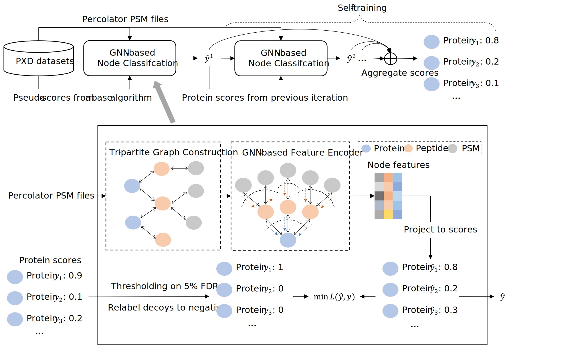

# GraphPI Protein Inference

## Folder Structure
    └── code: contains the source code for the project.
        └── main_train.py: main file to train the model.
        └── main_eval.py: main file to make predictions.
        └── configs.py : contains the configuration for the project.
    └── data: contains our test data, which includes:
        └── PSM features.
        └── Fasta database (these two constitute the input to our algorithm). 
        └── Results from other algorithms.
    └── results: our trained model is saved here, also includes:
        └── Protein groups.
        └── Prediction made by our algorithm.
    └── knime_workflows: contains the knime workflows.
        └── generate_decoy: generate decoy database based on fasta file.
        └── comet_search: execute peptide search algorithm
        └── epifany_pipeline: run epifany on Percolator results, also includes Percolator to generate PSM features.
        └── fido_pipeline, pia_pipeline: run fido and pia.

## Usage

### Environment Setup

For environment preparing, please use conda:

``conda env create -f environment.yml``

### Train

#### Pretrain data

We use data from the public repository (promeXchange) for training purpose, 
the link to download the raw files are included in Supporting Table S2.
Please run the following procedure to acquire training data.

1. Download the raw files from proteomeXchange, the fasta database from Uniprot.
2. Run the generate_decoy knime workflow to generate a decoy fasta database.
3. Convert raw file into mzML format using ProteoWizard (with peaks picking).
3. Run the comet_search knime workflow with mzml and decoy fasta files for peptide database search, please make sure to use correct search parameters from the dataset provider.
4. Run the epifany_pipeline knime workflow with idxml and decoy fasta files to generate the psm features and epifany scores.
5. Collect the psm and epifany scores for all training data.

To run this program for demonstration, we provide the psm and epifany scores for one single dataset which is stored in ``data/PXD005388/``.

Please make sure to use KNIME version 4.7.7 for our workflows.
#### Run
Change the ``DATA_LIST`` in the configs file to the updated pretraining PXD datasets. (e.g., if you want to only use PXD005388 for training, then set ``DATA_LIST=["PXD005388"]``.)

Run ``python main_train.py --save_result_dir=test_run`` in the ``code`` folder to train the model.

### Inference

#### Test data

For our comparison study, our test data (and download links) are listed in Supporting Material S1.
The processed PSM features and decoy databases are included in the data folder.

#### Run
Please set the ``TEST_DATA`` variable in configs.py to our test datasets, for instance,

``TEST_DATA = ['ups2', '18mix', 'yeast', 'iPRG2016_A', 'iPRG2016_AB', 'iPRG2016_B', 'hela_3t3']``

To make predictions on our test datasets using your trained model, please run ``python main_eval.py --save_result_dir=test_run``, ROC plots will be generated
for every test data under ``test_run/predictions/``.

To generate the predictions on the test datasets using our pre-trained model, please run ``python main_eval.py`` directly. The results will be stored in ``results/predictions/``.

#### Evaluate on any dataset
To evaluate any dataset with just raw and fasta files, please follow the steps below:
1. Run the generate_decoy knime workflow to generate a decoy fasta database.
2. Convert raw file into mzml format using ProteoWizard (with peaks picking).
3. Run the comet_search knime workflow with mzml and decoy fasta files for peptide database search, please make sure to use correct search parameters from the dataset provider.
4. Run the epifany_pipeline knime workflow with idxml and decoy fasta files to generate the psm features.
5. Create a folder under ``data``, the datafolder must have precix ``TestDataset``, put the psm feature and decoy fasta files to appropriate positions in the folder.
The psm feature file should be stored as ``data/TestDataset{your_data_name}/psm_features/result.csv``, and the decoy fasta file should be stored as ``data/TestDataset{your_data_name}/database/decoy.fasta``
6. Modify the config file to include the new test dataset, the name of the test dataset should be the same as the data folder.
7. Run ``main_eval.py`` under the ``code`` folder to make predictions.
8. Prediction result will be stored in ``results/predictions/TestDataset{your_data_name}/``
9. Please execute ``code/read_prediction_result.ipynb`` notebook to check out prediction result, and apply decoy FDR filtering.

Note that epifany_pipeline will run both Percolator and Epifany, and here we only need the result from Percolator.

For example, we included ``TestDataset004789`` as an example of how to evaluate on a new dataset, it is stored under ``data/``, and is derived from the ``PXD004789`` ProteomeXchange dataset..
